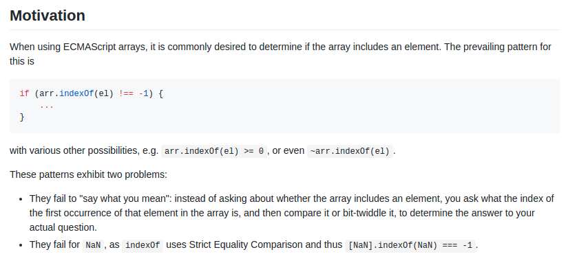
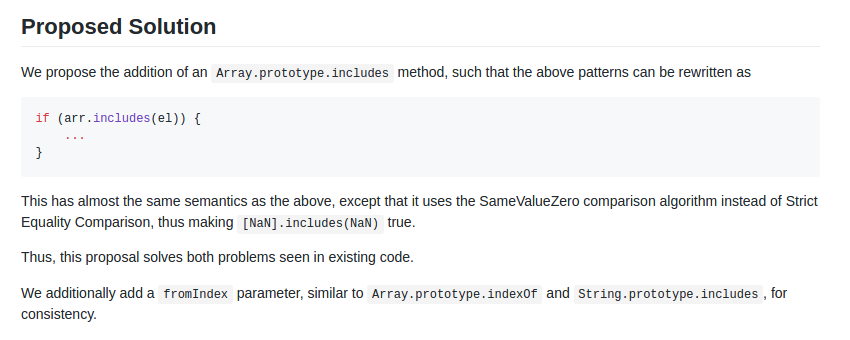

# Jak nadążyć za jsem?
## by Olgierd &#34;Allgreed&#34; Kasprowicz

Note:
- Techniczna: Dodatkowy monitor na notatki dopiąć [#nabogato] :DD
- Techniczna: Odpalić fullscreen przy pomocy F11, a nie "f"

- Polecam zaciągnąć prezkę z Githuba [link na Meetupie] -> dużo linków w materiałach + kody demo do śledzeine na bieżąco
- To nie jest szkoła, jak nie rozumiecie to krzyczcie [test: "Importując tensor-flow wygenerujemy exploita Emacsem przez Sendmail"]
- Jaki poziom nadążania za JSem na sali? (AA / 3lvl: let+const | async+await | dekoratory)


# <span style="color: #b58900">Disclaimer</span>
<!-- .slide: data-background-color="black" -->

Note:
- Podziękować Kitty, że jest tutaj ze mną
- Moje opinie są moje, a nie mojego pracodawcy lub podmiotów, w których jestem udziałowcem / akcjonariuszem.
- Prezka jest w pełni open-source, na licencji MIT, zrobiona przy pomocy reveal.js [open-source] i GIMPa [też open-source]. Żaden Photoshop nie został spiracony podczas jej tworzenia.


<!-- .slide: data-background-color="black" -->


- Oszczędność czasu i hajsu
- Kultura wymiany wiedzy
- Community
- FLOSS


## <span style="color: #b58900">Disclaimer: Facebook i kaluzula patentowa</span>
<!-- .slide: data-background-color="black" -->


Note:
Obczajcie sobie na Githubie
Paczki niespoko od Fejsa: React, Jest, GraphQL
Paczki spoko od Fejsa: Yarn


## <span style="color: #b58900">O czym nie będzie</span>
<!-- .slide: data-background-color="black" -->


Note:
Ekosystem vs język. Nie będzie o paczkach i nie będzie o API przeglądarkowym / C++owym.


<h1 style="font-size:2.11em">???????</h1>

- TypeScript
- CoffeeScript
- Mocha
- LiveScript
- Jscript
- <span style="font-weight: bold; color: #b58900">JavaScript</span>
- ECMAScript
- ECMA-262
- ES6
- ES2015

Note:
Tyyyyyyyle dziwnych nazw, ktoś wie co one wszystkie znaczą? PS. Mocha to nie test runner ;)


## Języki kompilowane do JSa


### CoffeeScript


Note:
Pojawił się w 2009, licencja MIT, imo trochę wygląda jak Pytong xD


### TypeScript


Note:
Pojawił się w 2012, licencja Apache 2.0, good job Microsoft


- Mocha
- LiveScript
- Jscript
- <span style="font-weight: bold; color: #b58900">JavaScript</span>
- ECMAScript
- ECMA-262
- ES6
- ES2015


## Krótka historia JSa


### Mocha - Maj 95' (Netscape)

Note:
Oryginalna nazwa "Mocha" przez foundera Netscape'u


### LiveScript - Wrzesień 95' (Netscape)

Note:
Nie mogłem znaleźć powodu zmiany nazwy


### JavaScript - Grudzień 95' (Netscape)

Note:
Sun Microsystems dał licencję na trademark "Java". Java była wtedy popularna w chuj, więc chcieli zyskać na hypie marketingowym.


### Jscript - 96' (Microsoft)

Note:
Microsoft nie chciał się pchać w przepychanki trademarkowe. Prawo w Stanach jest pojebane w tym zakresie. W tym momencie jest to "wtyczka" do .NETa, nie przejmujcie się tym


- ECMAScript
- ECMA-262
- ES6
- ES2015
- <span style="font-weight: bold; color: #b58900">JavaScript</span>


##  ECMAScript - 97' (ECMA International)

European Computer Manufacturers Association

Note:
Netscape przekazał prace nad językiem. To nie są jakieś korpo-buce, tylko oddolna organizacja standaryzująca, współpracują też z rządowymi organizacjami standaryzującymi.Nazwę zmienili, bo nie chcą się bujać z Sunem odnośnie trademarków. Mieli też historie submitownaia i unsubmitowania propozycji standaryzacji Javy.


## ECMA-262 = ECMAScript

Note:
Nazwa kodowa ECMAScript
ECMA standaryzuje też C++ (372), C#(334) i JSONa(404) [Mem, bo na wikipedii nie ma tej strony xD].


## Krótka historia ECMAScript


### Pierwsze wydanie - Czerwiec 97'

Note: 1 wydanie, rok później. Kompatybliność z ISO.


### 3 - Czerwiec 98'

- RegExpy
- Try/Catch


### Niiiiiiiiiiiiiiiiiiiiiiiiiiiiiiiiic...


### 5 i 5.1 - Czerwiec 2009 / 2011

Note:
Troszku poprawione, kompatybilne z ISO


### Teraz
### ES6 = ES2015

Note:
No ogólnie zadziało się dużo, lista zmian w materiałach (m.in. inne deklarowanie zmiennych, template literals, Promises, module syntax [import/export]). Czy wszyscy to kojarzą +-? ECMA obiecała wypuszczać standard co roku i stąd numeracja (nie wersja standardu, a rok wypuszczenia).


- <span style="font-weight: bold; color: #b58900">JavaScript</span>


## <span style="color: #b58900">JavaScript</span> ???

- TL:DR -> JS = ES
- Długa odpowiedź

Note:
JS = (Implementacja ^ dialekt) ES + (BrowserAPI ^ C++ API)  
Język jest zbiorem reguł / standardem, więc implementacja to kompilator / interpreter (np. V8)  
Imo bardziej dialekt    
Oba terminy są używane.     


# Jak nadążyć za ECMAScript?

Note:
Tak powinien brzmieć tytuł. Tylko wtedy nikt by nie przyszedł, bo nie wiedzałby o co chodzi ;)


## RSS, Twitter, Blogi, Meety, Nagrania z konfernecji...


Note:
- Odstęp czasowy między zmianą w proposalu, a publikacją artykułu (czas na zauważenie, przetworzenie [w tym jakieś zabawy z ficzerem], pisanie i publikację -> rozrysować na tablicy jak będzie opcja)
- Nie pokrywają wszystkiego (nie o wszystkich rzeczach ktoś chce pisać)
- Zopiniowane i okrojone (jakby nie były okrojone to można byłoby zreposotwać proposal)


## TC39


Note:
Osoby bezpośrednio odpowiedzialne za standaryzację ES. Członkami są też firmy, m.in. Facebook, GoDaddy, Bloomberg, które wysyłają swoich ludzi. Spotykają się kilka razy w roku i ogarniają ficzery.


## Przykładowy proposal

<a href="https://github.com/tc39/Array.prototype.includes" target="_blank">Array.prototype.include </a>

Note:
[Tab + Enter]
Lajtowy ficzer (niewiele dodatkowej syntaksy), używamy w Aidlabie na produkcji. Jak ktoś widział jedno README na Githubie to widział je wszystkie.


## Z czego się składa i jak czytać?

- Problem
- Rozwiązanie
- Status
- (opcjonalnie: dodatkowe info)

Note:
- Czemu w ogóle ten prospoal powstał?
- Jak rozwiązuje opisany problem (włącznie z formalną specką i testami)?
- Jak idzie implementacja?

Nie zawsze w ten sposób, nie zawsze w widocznym miejscu, ale te informacje tam są.


### Problem



Note:
Kto kiedykolwiek napisał taki kod w JSie jak jest na slajdzie? Kto rozumie problem? Kto uważa, że to jest istotny problem (wtedy warto czytać dalej)? 


### Rozwiązanie



Note:
Kto uważa, że to jest spoko rozwiązanie? Kto będzie używał od dzisiaj?


### Status


<!-- TODO -->
#### Miara gotowości specyfikacji (Stage 0 -> w języku)

### Jak czerpać ze źródełka?


```
    [Link do repo]/commits/master.atom
```
<a href="https://github.com/tc39/Array.prototype.includes/commits/master.atom" target="_blank"></a>

Note:
(Rich Site Summary). Automatyczne, konfigurowywalny news-feed => konfigurowywalna ściana na Facebooku, tylko hackerska :D

- Kto zna RSS?
- Kto używa RSS?
- Najlepiej śledzić Githuba, najlepszy S/N ratio. Można śledzić manifest, albo konkretne proposale.
- Możecie tym nakarmić wasz ulubiony czytnik.
- Niby jest też Twitter, ale wygląda na wymarły, link w materiałach

<!-- Tu skończyłem, pozmieniać tytuły -->


## Co nowego?

### Syntactic sugars (Array.prototype.include, exponential operator -> przykłady)

### Async / Await

#### ???
#### Callback vs Promise vs. Generator
#### Przykład (concurent i waterfall)

## Jak używac nowych rzeczy? (z kompatybilnością wsteczną)

### Babel (zaznaczyć licencję)
### Pokaz transpilacji (basic, coś bardziej zaawansowanego i async / await)
### Używanie niestandardowych wtyczek (es7/es8 -> coś fajnego)
### Pisanie własnego transpilatora (coś basic, ze stage'a 2, np. numeric literals, w Pythonie czy cuś)

## Pomaganie w tworzeniu specków

https://esdiscuss.org/topic/having-a-non-enumerable-array-prototype-contains-may-not-be-web-compatible
- Na liście dużo się dzieje, ale głównie noise + nie jest oficjalna. 
<!-- Wypowiadają się championi, dobry case -->

## Bądź do przodu zanim inni będą! (Jak złozyć swój własny proposal kontrybucji do JSa)
<!-- Jak wygląda cały proces -->
<!-- TU skończyłem -->


# Pytanka? :)


# To podziękował